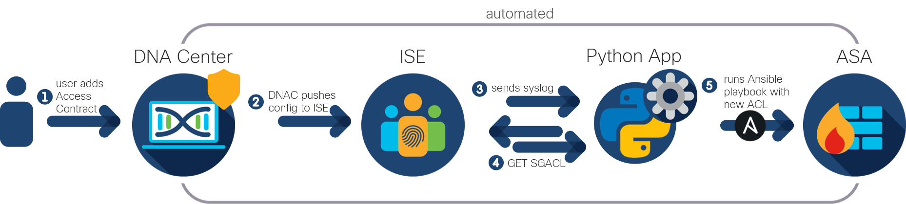

# SGACL Sync between DNA, ISE and ASA

An application to automatically apply SGACLs created in Cisco DNA Center and ISE to ASAs using Ansible. This is following a similar logic to the [SGT Exchange Protocol](https://www.cisco.com/c/en/us/td/docs/switches/lan/trustsec/configuration/guide/trustsec/sxp_config.html) in an SD-Access environment ([see here](https://www.cisco.com/c/en/us/solutions/collateral/enterprise-networks/software-defined-access/white-paper-c11-741103.html)). 

## Overview
 

**DNA Center**: [Cisco DNA Center](https://www.cisco.com/c/en/us/products/cloud-systems-management/dna-center/index.html) is the network management and command center enabling an [SD-Access solution](https://www.cisco.com/c/en/us/solutions/enterprise-networks/software-defined-access/index.html). Within DNAC, (1) the network admin can create [access contracts](https://www.cisco.com/c/en/us/td/docs/cloud-systems-management/network-automation-and-management/dna-center/1-3-1-0/user_guide/b_cisco_dna_center_ug_1_3_1_0/b_cisco_dna_center_ug_1_3_1_0_chapter_01011.html), which are a set of rules that control which traffic is allowed to pass between source and destination scalable groups.

**ISE**: In an SD-Access solution, [Cisco ISE](https://www.cisco.com/c/en/us/products/security/identity-services-engine/index.html) activates the policies and access contracts created in DNAC in the underlying infrastructure. Therefore, DNAC and ISE must be integrated and in sync to share the required data securely and consistently. In this use case, (2) the in DNAC created access contracts are automatically pushed to ISE, where they are registered as [SGACLs](https://www.cisco.com/c/en/us/td/docs/switches/lan/trustsec/configuration/guide/trustsec/sgacl_config.html). This is a standard workflow in SD-Access and (3) if enabled, it creates and sends a syslog to be notified about the newly created SGACL. 

**Python Application**: The Python app in this use case is working as a UDP syslog server, whereby it uses the syslog sent by ISE as a trigger. It retrieves the detailed SGACL information by (4) calling the [ISE External RESTful Services APIs](https://developer.cisco.com/docs/identity-services-engine/3.0/#!setting-up) and then uses that information to update the Ansible playbooks accordingly. 

**ASA**: Even when not part of the SD-Access fabric, [Cisco ASA firewalls](https://www.cisco.com/c/en/us/products/security/asa-firepower-services/index.html) must enforce the same policies that are being enforced within the SDA fabric, such as when it terminates VPN connections of remote employees. Therefore, the SGACLs present on the ISE should also be configured on the ASAs. 

**Ansible**: [Ansible](https://www.ansible.com/) is an open-source tool enabling infrastructure as code and is used in this script to configure in DNAC and ISE created SGACLs on the ASAs. In this use case, the [ASA Ansible modules](https://docs.ansible.com/ansible/2.8/modules/list_of_network_modules.html#asa) are used, and the playbooks are (5) executed using the [ansible_runner](https://ansible-runner.readthedocs.io/en/stable/python_interface.html) Python module.

**Logging**: The application includes some basic logging to the `app.log` file. 

## Contacts
* Jara Osterfeld (josterfe@cisco.com)

## Solution Components
* DNA Center
* ISE
* ASA
* Python
* Ansible

## Prerequisites
- **DNAC and ISE integration**: If not already set up, to integrate ISE with DNAC, follow the instructions [here](https://www.cisco.com/c/en/us/td/docs/cloud-systems-management/network-automation-and-management/dna-center/1-2/install/b_dnac_install_1_2/b_dnac_install_1_2_chapter_010.html#id_57243).
- **ISE**: 
   - **Syslog**: ISE needs to be configured to send the syslog to the Python application of this use case. To do that, follow these steps: 
     1. Configure the application as *Remote Logging Target*: 
                            
        From the ISE admin interface, go to **Administration > System > Logging > Remote Logging Targets**, and click **Add**. Provide a **Name** for the new target and the **IP Address** of the device on which the Python application is running (must be in the same network as the ISE instance). The other fields can keep their defaults. Click **Save**. 
     
     2. Assign the *Remote Logging Target* to the right *Logging Category*:
     
        From the ISE admin interface, go to **Administration > System > Logging > Logging Categories**. Click the radio button next to the category **Administrative and Operational Audit** and click **Edit**. Under **Targets**, move the remote logging target that you just created from the box labeled **Available** to **Selected**. Then click **Save**. 
   - **ERS API**: As the application uses the ISE ERS API, it needs to be enabled on ISE following the instructions [here](https://developer.cisco.com/docs/identity-services-engine/3.0/#!setting-up). 
- **ASA configurations**:
   - **interface *nameif* command**: The interface on which the ACL on the ASA should be applied to must be configured with a name using the *nameif* command on the interface. 
   - **ACL interface direction**: By default, in this use case, the SGACL is applied as an ACL on the ASA to traffic coming into the interface, i.e. by configuring the *access-group acl_name **in** interface int_nameif* command on the ASA. You can change that command line to apply the ACL to outgoing traffic by changing the last line of the `asa_acl.yml` file from '*access-group {{  acl_name  }} **in** interface {{  int_nameif  }}*' to '*access-group {{  acl_name  }} **out** interface {{  int_nameif  }}*'.
- **Ansible control node requirements**: The script must be run from a machine that fulfils the [Ansible control node requirements](https://docs.ansible.com/ansible/latest/installation_guide/intro_installation.html#prerequisites).

## Installation

1. Clone this repository with `git clone <this repo>`.

2. Open the `credentials.yml` file, and fill in the following ISE credentials within the quotation marks (note that the credentials must be from a user with the privilege to use the ISE ERS APIs as described in the [Prerequisites](##Prerequisites) section):
        
        ISE_username: ''  
        ISE_password: ''
        
3. Navigate to the `inventory` directory and open the `hosts` file. Where a description in between the < > brackets is provided, add the information of your environment accordingly:
        
        [asa]
        <IP address of ASA>
        
        [asa:vars]
        ansible_user=<ASA username>
        ansible_password=<ASA password>
        ansible_connection=network_cli
        ansible_network_os=asa
        ansible_become=true
        ansible_become_method=enable
        ansible_become_pass=<ASA enable password>
        int_nameif=<ASA interface name to which apply the SGACL to**>
        
   ** must be the same as configured on the ASA interface with the *nameif* command (see [Prerequisites](##Prerequisites) section)

4. (Optional) Create a Python virtual environment and activate it (find instructions [here](https://docs.python.org/3/tutorial/venv.html)).

5. Navigate to the root directory of the repository in the terminal, and install the requirements with `pip install -r requirements.txt`.

6. Run the application with `python main.py`.

## License
Provided under Cisco Sample Code License, for details see [LICENSE](./LICENSE).

## Code of Conduct
Our code of conduct is available [here](./CODE_OF_CONDUCT.md).

## Contributing
See our contributing guidelines [here](./CONTRIBUTING.md).